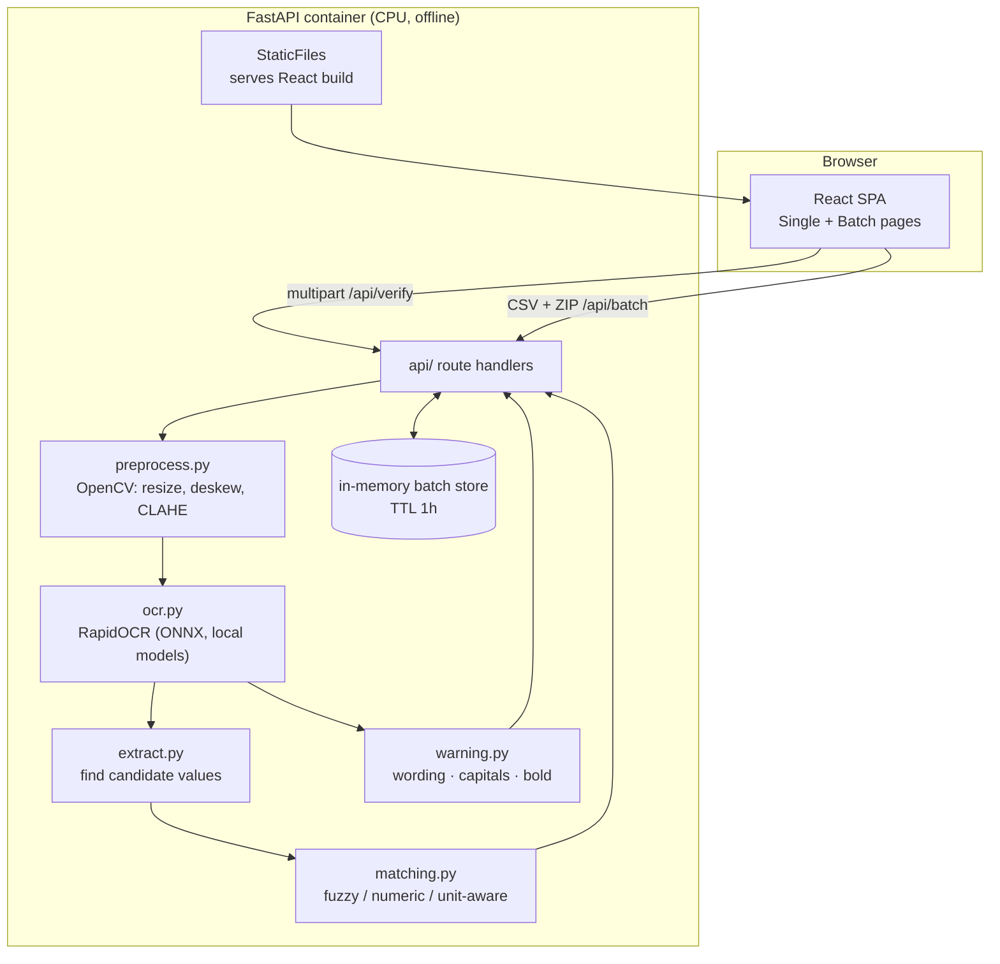

# LabelCheck — Full Documentation

- [1. What the application does](#1-what-the-application-does)
- [2. Architecture](#2-architecture)
- [3. The verification pipeline](#3-the-verification-pipeline)
- [4. Tech stack and why](#4-tech-stack-and-why)
- [5. Constraints and how they are met](#5-constraints-and-how-they-are-met)
- [6. Performance](#6-performance)
- [7. Data handling & privacy](#7-data-handling--privacy)
- [8. API reference](#8-api-reference)
- [9. Testing](#9-testing)
- [10. Assumptions](#10-assumptions)

---

## 1. What the application does

LabelCheck helps a TTB compliance agent confirm that an **alcohol label image** matches the
**application data** submitted for it. The agent provides both; the tool reads the label and
reports, field by field, whether each required detail matches — then lets the agent decide.

It checks the fields required by beverage type:

| Field | Beer | Wine | Spirits |
|---|---|---|---|
| Brand name | ✓ | ✓ | ✓ |
| Class/type designation | ✓ | ✓ | ✓ |
| Alcohol content | optional | optional | ✓ |
| Net contents | ✓ | ✓ | ✓ |
| Bottler/producer name & address | ✓ | ✓ | ✓ |
| Country of origin | imports | imports | imports |
| Government Health Warning | ✓ | ✓ | ✓ |

Each field gets one of five statuses — **Match**, **Needs review**, **Mismatch**,
**Not found**, **Not required** — shown as icon + word + color. The overall result is the
worst status across all fields (the tool never says "Match" if the warning is missing).

**Requirements coverage:** FR‑1 (image + application input) · FR‑2 (OCR read) · FR‑3
(per-field pass/fail) · FR‑4 (three-way fuzzy match for ordinary fields) · FR‑5 (strict
Government Warning: wording, capitals, bold) · FR‑6 (expected vs found + reason shown) ·
FR‑7 (batch of CSV + ZIP with a summary) · FR‑8 (copes with angle/glare, says so when
unreadable).

---

## 2. Architecture

One FastAPI process serves both the JSON API and the built React app. There is no database
and no external service — everything runs in-process on CPU.

```
                        Browser (compliance agent)
            ┌───────────────────────────────────────────────┐
            │  React + TypeScript SPA (Vite build)           │
            │  • Check one label     • Check a batch         │
            │  • downscales images client-side before upload │
            └───────────────┬───────────────────────────────┘
                            │  HTTPS, same origin
                            │  multipart upload / JSON  (/api/*)
                            ▼
            ┌───────────────────────────────────────────────┐
            │  FastAPI (single container)                    │
            │                                                │
            │  api/        thin route handlers               │
            │   ├─ /api/verify      single label             │
            │   ├─ /api/batch       CSV + ZIP → job          │
            │   └─ /api/batch/{id}  status + partial results │
            │                                                │
            │  services/   business logic (pure where able)  │
            │   preprocess → ocr → extract → matching        │
            │                                └─ warning       │
            │                                                │
            │  in-memory batch store (TTL 1h, no disk)       │
            │  OCR model loaded ONCE at startup (lifespan)   │
            │                                                │
            │  StaticFiles ── serves the React build ────────┼──► UI
            └───────────────────────────────────────────────┘
                 No outbound network calls. Models baked in.
```

The same flow as a Mermaid diagram (renders on GitHub):



**Layers, strictly separated:**
- `api/` — request validation and shaping only; no business logic.
- `services/` — the pipeline; mostly pure functions (input → output) so they unit-test
  cleanly and run safely in worker processes.
- `models.py` — Pydantic models that are the single source of truth for the API contract
  and the frontend's generated types.

---

## 3. The verification pipeline

For one label (`backend/app/services/pipeline.py`):

1. **Preprocess** (`preprocess.py`, OpenCV): decode → resize to ≤ 2000px long edge →
   grayscale → estimate and correct small skew → CLAHE on the lightness channel to lift
   contrast and tame glare. The deskewed **color** image is kept for the bold check.
2. **OCR** (`ocr.py`, RapidOCR): returns text lines with bounding boxes and per-line
   confidence. Boxes are kept — the bold check and future "where on the label" features
   need them. The engine is loaded once at startup and reused.
3. **Extract** (`extract.py`): rather than parse a label from scratch, it uses each
   expected value to *find* the best-matching OCR line(s); numeric fields are found by
   pattern.
4. **Match + warning** (`matching.py`, `warning.py`): compares each field per the TTB
   rules and runs the three Government-Warning sub-checks. The worst status wins overall.

Timings for every stage (`preprocess`, `ocr`, `match`, `total`) are returned in the
response and logged; a label over the budget logs a warning.

For a **batch**, the CSV and ZIP are validated up front (columns, per-row required fields,
every row has an image and vice-versa, file types, zip-slip/zip-bomb guards) and **all**
problems are returned at once. Valid pairs are processed in a `ProcessPoolExecutor` sized
to the CPU count, with results streamed into an in-memory job as each finishes so the UI
shows live progress.

---

## 4. Tech stack and why

| Layer | Choice | Why this fits a firewalled, 5-second, prototype |
|---|---|---|
| OCR | **RapidOCR** (PaddleOCR models on ONNX Runtime, CPU) | Accurate, **fully local** — the models ship inside the pip wheel, so there is no runtime download and no external call. Fast on CPU (hundreds of ms/label), which is what the 5-second budget and the firewall both demand. |
| Image processing | **OpenCV** | Battle-tested, local, cheap. Handles resize, deskew, contrast/glare (CLAHE), and the stroke-width math behind the bold check. |
| Fuzzy matching | **RapidFuzz** | Fast C++-backed string similarity for the three-way match (match / review / mismatch) and for locating fields in OCR output. |
| Backend | **FastAPI + Pydantic v2** | Minimal, typed, async. Pydantic models double as the OpenAPI contract the frontend types are generated from, so the two sides can't drift. |
| Frontend | **React 18 + TypeScript + Vite + Tailwind + TanStack Query** | Fast, typed, small. Tailwind makes the large-type, high-contrast accessibility rules easy to apply consistently; TanStack Query handles the batch polling and loading/error states cleanly. |
| Packaging | **Single Docker container** | FastAPI serves the React build, so there's one artifact to deploy (→ Azure Container Apps). Models baked in at build time keep the runtime offline. |

**Why not a cloud vision API?** The agency firewall blocked the previous vendor's cloud ML,
and the 5-second budget leaves no room for round-trips. Local OCR removes both risks. A
cloud vision model remains possible as an *optional* upgrade: it sits behind
`LABELCHECK_CLOUD_VISION` (off by default) and the app works fully without it.

**Why these suit a prototype, not an enterprise build:** no database, no message queue, no
auth service — just a stateless container with in-memory batch jobs. It's small enough to
read in an afternoon and fast to deploy, while the clean service boundaries leave room to
grow (persistency, a cloud-vision fallback, COLA integration) without a rewrite.

---

## 5. Constraints and how they are met

| Constraint | How LabelCheck meets it |
|---|---|
| **≤ 5 s per label** | Local CPU OCR; model loaded once at startup; OCR runs off the event loop; per-stage timings logged. Measured worst case ≈ 0.35 s/label on a laptop. |
| **Usable by non-technical users** | 18px base font, large full-width buttons (≥ 44px targets), two always-visible tabs, plain button verbs, status as icon+word+color, plain-English errors, keyboard-accessible with visible focus. |
| **No outbound network at runtime** | OCR models bundled in the wheel/image; no dependency calls out; optional cloud vision is off by default and fails soft. |
| **No persistent storage** | Uploads processed in memory; batch results held in an in-memory store with a 1-hour TTL; nothing written to disk or a database. |
| **Agent makes the final call** | The tool only flags. Ambiguous results are **Needs review**, never auto-rejected. |
| **Rules depend on beverage type** | `beverage_rules.yaml` drives which fields are required; ABV optional for beer/wine, country for imports only. |
| **Standalone (no COLA)** | Application data comes from the form or the batch CSV. |

---

## 6. Performance

The budget is ≤ 5 s end-to-end, target ≤ 3 s. Measured over the 15 sample labels on a
laptop (server-side `total`): **~95–350 ms per label**. Headroom comes from:
- Loading the OCR model once (`lifespan`), so cold start is never on the request path.
- Capping the image at 2000px (downscaled client-side too).
- Running OCR in a thread/process pool so the async server stays responsive.

The performance test asserts both end-to-end `< 5 s` and server `total < 4 s` for every
sample, so regressions are caught in CI.

---

## 7. Data handling & privacy

- **No PII at rest.** Images and results are never written to disk or a database.
- Single-label requests are processed from in-memory bytes and discarded when the response
  is sent.
- Batch jobs live in an in-memory dict keyed by a random UUID, swept after a 1-hour TTL.
- Logs never include image contents or full field values at INFO level.
- Uploads are bounded (image ≤ 20 MB; ZIP ≤ 500 MB / ≤ 500 images / uncompressed cap) and
  ZIPs are read with zip-slip and zip-bomb guards.

---

## 8. API reference

| Method | Path | Purpose |
|---|---|---|
| `GET` | `/api/health` | Liveness + whether the OCR model is loaded. |
| `POST` | `/api/verify` | Multipart: `image` file + `application` JSON → `VerificationResult`. |
| `POST` | `/api/batch` | Multipart: `csv` file + `images` ZIP → `{batch_id, total, problems[]}`. |
| `GET` | `/api/batch/{id}` | `{status, done, total, results[]}` — partial results while running. |
| `GET` | `/api/batch/{id}/export.csv` | Results so far as a CSV download. |

Errors are returned as `{"detail": "<plain-English message>"}` with an appropriate status
code (e.g. 415 for a non-image upload). The UI shows `detail` directly. Full interactive
docs are available at `/docs` when the server is running.

---

## 9. Testing

| Layer | Tool | What it covers |
|---|---|---|
| Matching & warning rules | pytest | Every rule row (text/ABV/net-contents, wording/capitals/bold). |
| Parsing | pytest | ABV/proof, net-contents units, CSV row validation. |
| Golden samples | pytest | Full pipeline over `samples/` vs `expected.json`. |
| Performance | pytest | Every sample under the 5-second budget. |
| API contract | pytest + TestClient | Upload validation and error shapes. |
| Components / interaction | Vitest + Testing Library | Status badges, progress text, errors, the single-check flow. |

Run them with the commands in the [README](../README.md#run-the-tests). The pure-logic
tests run with no OCR engine installed; the golden-sample and performance tests skip
cleanly if the engine or sample set is absent, and run in CI where both are present.

---

## 10. Assumptions

The open decisions (data source, exact warning wording, the bold heuristic, beverage-type
rules, matching tolerances) are documented in [assumptions.md](assumptions.md).
